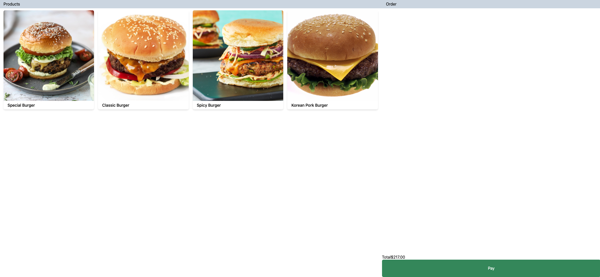

# mx51 Technical Interview

Hi!

This interview process is a pair programming exercise where you will drive, and we will follow along and provide feedback as is required.
When the interview begins, you will be assigned a user story to modify this POS (Point of Sale) application. 
We will be available to answer any questions around the application or story.

Please take the time before your interview day to get this app up and running, 
study the code base and familiarise yourself with the common patterns used.

The interview will last for 1 hour, and we will work together on the story for 
roughly 35-45 minutes before having further discussion.

## Interview Setup
Please let us know which IDE you would prefer to use. Ideally we will be able to pair program remotely. 

### For VS Code
Please install the [liveshare](https://marketplace.visualstudio.com/items?itemName=MS-vsliveshare.vsliveshare-pack) extension.

### For Webstorm
If possible, please use [Code with Me](https://www.jetbrains.com/code-with-me/)

If either of these is not suitable please update us beforehand. 

## App

The app is a simple POS (point of sale) application. It allows the user to select multiple burgers and place an order.



The frontend app is a React app, using Typescript, and bundled with Vite.

The app has been designed to limit prop drilling and shared state and makes use of reasonable 
component composition to keep everything tidy. 

## Styling 

It uses css modules for styling.

## Assets

If icons are required, please use [react icons](https://react-icons.github.io/react-icons)

## Develop

```bash
npm install
npm run dev
```

## Test

The tests are currently high level, only testing the most critical parts of the application.

```bash
npm run test
```

## Build & Deploy

Deployment script/processes will depend on deploy target...

To build the react app (static files), run;

```bash
cd npm run build
```