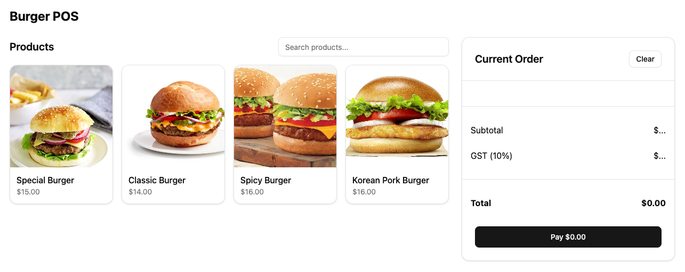

# mx51 Frontend Technical Interview

Hi!

This interview process is a pair programming exercise where you will drive, and we will follow along and provide feedback as is required.
When the interview begins, you will be assigned a user story to modify this POS (Point of Sale) application.
We will be available to answer any questions around the application or story.

Please take the time before your interview day to get this app up and running,
study the code base and familiarise yourself with the common patterns used.

The interview will last for 1 hour, and we will work together on the story for
roughly 35-45 minutes before having further discussion.

> [!NOTE]  
> We are not expecting you to complete the story, just get as far as you can. We are more interested in your thought process and coding style.

## The interview

> [!IMPORTANT]  
> We will ask you to share your screen, please ensure you are ready to do so.

We will passively "pair" with you, meaning we will not give you any instructions, but will ask questions and provide feedback as we see fit.

You are welcome to ask questions at any time! We're more than happy to help you get the most out of the interview. If you want to bounce ideas off us, we're all ears!

You can use any tools you are comfortable with. Day-to-day, we use AI code editing tools, and IDEs. If you need to look things up, check something on Stack Overflow, Google, or ask ChatGPT that's totally fine!

In the process of completing the story, we will ask you questions about your thought process. We're not looking for a specific answer, but rather your reasoning and how you go about solving problems.

## The app

The app is a simple POS (point of sale) application. It allows the user to select multiple burgers and place an order.



The frontend app is a React app, using Typescript, and bundled with Vite.

Stack:

- React
- Typescript
- Vite
- Shadcn UI / TailwindCSS
- Tanstack Query

## Develop

```bash
npm install
npm run dev
```

## Test

The tests are currently high level, only testing the most critical parts of the application.

```bash
npm test
```

## Build & Deploy

Deployment script/processes will depend on deploy target...

To build the react app (static files), run;

```bash
npm run build
```
