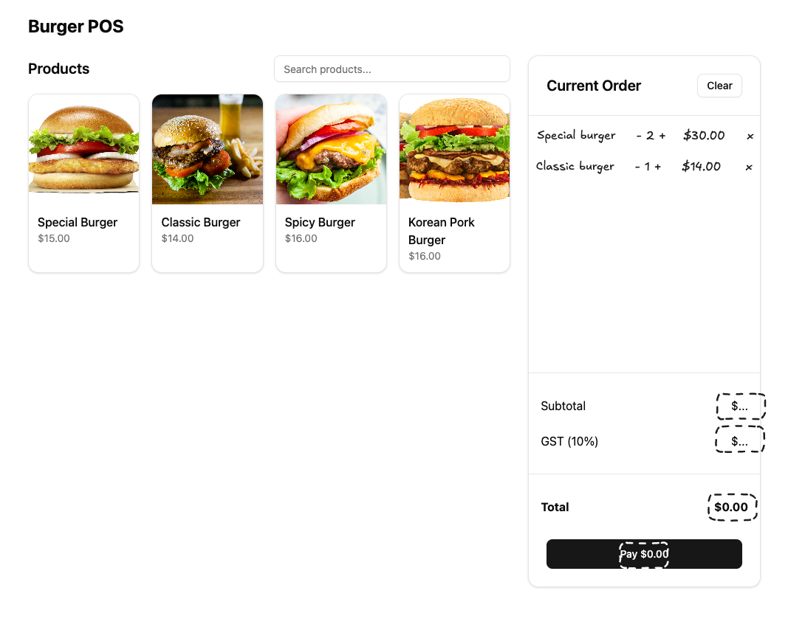

# Task

The task is to update the app to allow the user to select some items and place an order. Currently, the user cannot select any items, and the order total is not shown.

# Acceptance Criteria

- The user can select items and see the order total
  - The items within the order should be displayed in a list in the Summary section
  - Each item in the list should show the name of the item, the quantity, and the price
  - Optionally you might want to show the image of the item
  - There should be a "+" and "-" button to increase and decrease the quantity of the item
- The order total should be displayed in the Summary section
- The order subtotal, GST and total should be shown in the Footer of the Summary section
- The "clear" button should remove all items from the order

If we have time, we will ask you to implement the "Pay" button, and submit the order.

# Notes

- The design is up to you. We haven't provided anything, and you're not being judged on your design skills.
- You can edit any files.
- You can install any packages you need.
- You can ask us any questions.
- You can use any tools you are comfortable with.
- You can use any resources you want.

# Example Image

